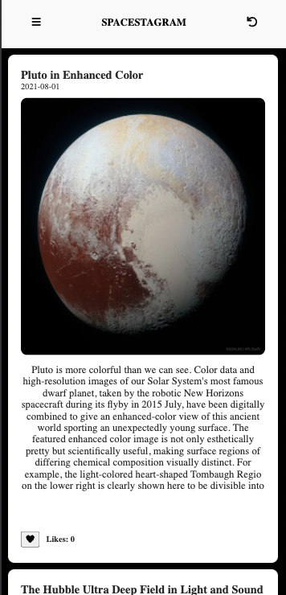

#  Spacestagram App. A Space image app
A Space Image  app to view lots of cool images from NASA using the Nasa API  Astronomy Picture of the Day.
[NASA-Astronomy picture of the day](https://apod.nasa.gov/apod/astropix.html).

 Users can view images, the App adds the current days image each day to the data, so they are always up to date. Users are able to like and unlike thier favorite images by clicking the click button.

## Live Demo
# [view site]()

## BUILT WITH
- React
- JavaScript
- NPM
- CSS
- ES6
- React-Create-App
- Redux
- CSS

## Getting Started
# Prerequisities

To run this project locally, you must have node and npm installed on your machine.

# Setup
To set up this project on your local machine:

Navigate to the folder where you want the repository to be copied and run on your terminal by typing
`cd Documents`

then

`git clone https://github.com/Stephanie041996/Spacestagram.git`

Navigate to the directory :

`cd crypto-tracker`

To start the server: 

`npm start`

Go to http://localhost:3000/ in your browser to see the application running

# To test the code

 - Run npm test
 - Enter 'a' to see all tests
## Author
**Stephanie Sakuhuni**

- GitHub: [@stephanie041996](https://github.com/Stephanie041996)
- LinkedIn: [Stephanie Sakuhuni](www.linkedin.com/in/stephanie-michelle-sakuhuni) 

- 
## 🤝 Contributing

Contributions, issues, and feature requests are welcome!

Feel free to check the [issues page](../../issues/).

## Show your support

Give a ⭐️ if you like this project!

## Acknowledgments

- Hat tip to anyone whose code was used
- Inspiration
- etc

## 📝 License

This project is [MIT](./MIT.md) licensed.
